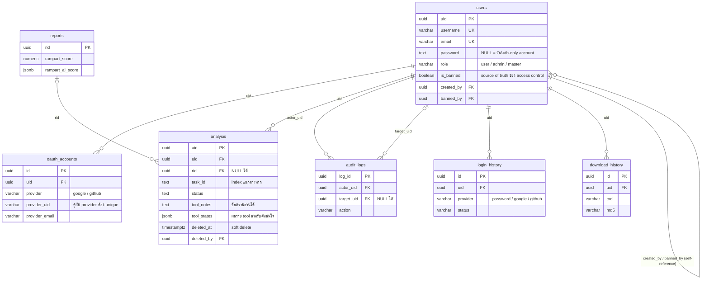

# SQL Architecture — ความสัมพันธ์ของตาราง (RAMPART API Server)

> แหล่งความจริง (source of truth) ของ schema คือ `cores/Schema/schema_class.py` — ตารางถูกสร้างอัตโนมัติตอน server start ผ่าน `init_db()`
> `CREATE-SQL.sql` เป็น mirror สำหรับ setup ฐานข้อมูลใหม่ด้วยมือ
> `cores/models_class.py` เป็น dead code (schema เก่าแบบ integer PK) ห้ามใช้อ้างอิง

## ภาพรวม

ทั้งหมด **7 ตาราง** ใช้ UUID เป็น primary key (`gen_random_uuid()` จาก extension `pgcrypto`) โดยมี `users` เป็นศูนย์กลาง — ทุกตารางที่เหลือยกเว้น `reports` จะมี FK กลับมาที่ `users.uid`

| # | ตาราง | กลุ่ม | 1 แถว = อะไร | PK | FK หลัก | คอลัมน์ |
|---|---|---|---|---|---|---|
| 1 | `users` | ตัวตน | บัญชีผู้ใช้ 1 บัญชี (local password หรือ OAuth) | `uid` | `created_by`, `banned_by` → `users.uid` | 15 |
| 2 | `oauth_accounts` | ตัวตน | identity ภายนอก 1 รายการที่ผูกกับ user (Google/GitHub) | `id` | `uid` → `users.uid` (CASCADE) | 6 |
| 3 | `analysis` | งานวิเคราะห์ | งานสแกน 1 งานของผู้ใช้ 1 คน (ตัวตนคือ `uid` + `file_hash`) | `aid` | `uid` → `users.uid` (CASCADE), `rid` → `reports.rid` (SET NULL), `deleted_by` → `users.uid` | 20 |
| 4 | `reports` | งานวิเคราะห์ | ผลรวมคะแนน 1 ชุดของเนื้อหาไฟล์ 1 ไฟล์ (แชร์กันทุก user ที่อัปโหลดไฟล์เดียวกัน) | `rid` | ไม่มี FK ออก (ถูก `analysis.rid` อ้างถึง) | 17 |
| 5 | `audit_logs` | ประวัติ/ตรวจสอบ | การกระทำสำคัญ 1 ครั้ง (actor + target + action) | `log_id` | `actor_uid` → `users.uid` (CASCADE), `target_uid` → `users.uid` (SET NULL) | 6 |
| 6 | `login_history` | ประวัติ/ตรวจสอบ | ความพยายาม login 1 ครั้ง (สำเร็จหรือล้มเหลว, ทุกช่องทาง) | `id` | `uid` → `users.uid` (CASCADE) | 7 |
| 7 | `download_history` | ประวัติ/ตรวจสอบ | การดาวน์โหลดรายงานดิบ 1 ครั้ง | `id` | `uid` → `users.uid` (CASCADE) | 6 |

## ER Diagram



## สรุปความสัมพันธ์ทั้งหมด

| # | FK (คอลัมน์ → เป้าหมาย) | Cardinality | ON DELETE | ความหมาย |
|---|---|---|---|---|
| 1 | `oauth_accounts.uid → users.uid` | 1 user : 0..N identity | `CASCADE` | ลบ user = identity ทั้งหมดหายตาม |
| 2 | `analysis.uid → users.uid` | 1 user : 0..N analysis | `CASCADE` | ลบ user = งานวิเคราะห์ของเขาหายตาม |
| 3 | `analysis.rid → reports.rid` | 1 report : 0..N analysis | `SET NULL` | ลบ report ได้โดย analysis ยังอยู่ แค่ไม่มีผลรวมให้ดู |
| 4 | `analysis.deleted_by → users.uid` | — | *(NO ACTION)* | ห้ามลบ user ที่เป็นคน soft-delete งานไว้ จนกว่าจะเคลียร์คอลัมน์นี้ก่อน |
| 5 | `audit_logs.actor_uid → users.uid` | 1 user : 0..N log | `CASCADE` | ลบ user = log ที่เขาเป็นคนทำหายตาม |
| 6 | `audit_logs.target_uid → users.uid` | 1 user : 0..N log | `SET NULL` | ลบ user = log ที่เขาเป็น "เป้า" ยังอยู่ แต่ไม่รู้ว่าเป้าคือใคร |
| 7 | `login_history.uid → users.uid` | 1 user : 0..N row | `CASCADE` | ประวัติ login ตาม user |
| 8 | `download_history.uid → users.uid` | 1 user : 0..N row | `CASCADE` | ประวัติดาวน์โหลดตาม user |
| 9 | `users.created_by → users.uid` | self-ref | *(NO ACTION)* | ใครสร้างบัญชีนี้ (admin สร้างให้) — ข้อมูลอ้างอิงเท่านั้น |
| 10 | `users.banned_by → users.uid` | self-ref | *(NO ACTION)* | ใครเป็นคนสั่งแบน |

ข้อสังเกต: คอลัมน์ที่ "จำคนทำ" ไว้เป็นหลักฐาน (`created_by`, `banned_by`, `deleted_by`) ตั้งใจไม่ใส่ `ON DELETE` — ปล่อยให้เป็น `NO ACTION` เพื่อกันลบ user ทิ้งแล้วหลักฐานเชื่อมโยงหาย ส่วนข้อมูลที่เป็นของ user (`oauth_accounts`, `analysis`, log ต่าง ๆ) ใช้ `CASCADE` ให้ลบสะอาดในครั้งเดียว

## รายละเอียดแต่ละตาราง

### `users`
บัญชีผู้ใช้เดียวของระบบ รับทั้งสองช่องทาง auth:
- **Local** — email + password (Argon2) + OTP → `password` มีค่า hash
- **OAuth** — Google/GitHub → `password` เป็น NULL

คอลัมน์สำคัญ:
- `email` / `username` — unique ทั้งคู่, email คือ canonical identity ที่ใช้เชื่อมบัญชีข้าม provider
- `role` — `user` / `admin` / `master` (`master` ได้มาจาก `ROOT_EMAIL` ตอน OAuth login เท่านั้น ห้ามผ่าน API/UI)
- `is_banned` (+ `banned_at`, `banned_reason`, `banned_by`) — **source of truth** ของ access control; `status` เป็น legacy flag ที่ไม่ authoritative แล้ว
- `fcm_token` — push notification

### `oauth_accounts`
แผนที่ "user คนนี้เชื่อมกับใครในโลกภายนอกบ้าง" — 1 user ผูกได้หลาย identity

- ค้นหา repeat login ด้วยคู่ `(provider, provider_uid)` — คู่นี้เท่านั้นที่ provider รับประกันว่า stable และ unique (`UNIQUE` constraint)
- ถ้ามาจาก provider ใหม่แต่ email ตรงกับ user เดิม (และ provider ยืนยัน email แล้ว) → เพิ่มแถวใหม่ชี้ไปที่ uid เดิม ไม่สร้างบัญชีซ้ำ (ดู `find_or_create_user` ใน `services/oauth/oauth_service.py`)
- `provider_email` แยกจาก `users.email` ตั้งใจ — email ที่ provider คืนมา (เช่น noreply ของ GitHub) ไม่จำเป็นต้องตรงกับ email หลักของบัญชี

**ทำไมไม่รวมเป็นตารางเดียวกับ `users`?** เพราะความสัมพันธ์เป็น 1:N (คนหนึ่ง login ได้หลาย provider) และมี user ที่ไม่มี OAuth เลย (local password) — ถ้ายุบเป็นคอลัมน์ `provider`/`provider_uid` บน `users` จะเก็บ identity ได้แถวละตัวเดียว ทำ linking ข้าม provider ไม่ได้ และ user แบบ password จะมีคอลัมน์เหล่านั้นเป็น NULL ตลอดชีวิต นี่คือ pattern มาตรฐานเดียวกับตาราง `accounts` ของ NextAuth / `identities` ของ Supabase

### `analysis`
งานสแกนหนึ่งชิ้นต่อหนึ่งแถว — สร้างที่ขั้น upload (status `pending`) แล้วถูก Celery task อัปเดตตลอด pipeline (VirusTotal → MobSF → CAPE → RampartAI → Gemini)

- **ตัวตนของแถวคือ `(uid, file_hash)`** — ผู้ใช้หนึ่งคนมีแถวที่ยังไม่ถูกลบได้ไม่เกินหนึ่งแถวต่อไฟล์หนึ่งไฟล์ (ชื่อไฟล์เป็นแค่ metadata ไม่ใช่ตัวตน) การอัปโหลดไฟล์เดิมซ้ำจะอัปเดตแถวเดิม ไม่สร้างใหม่ ดู `docs/analysis-dedup-design.md`
- `task_id` — Celery task ที่รันงานนี้; หลายแถว (คนละ user) แชร์ `task_id` เดียวกันได้เพราะ dedup ด้วย file hash — รอบซ่อม (repair run) จะ re-point แถวเดิมไป `task_id` ใหม่โดย `rid` เดิมไม่เปลี่ยน
- `status` — `pending` → ... → `success` / `failed` / skipped states ต่าง ๆ
- `tool_notes` — ข้อความไทย/อังกฤษสำหรับแสดงผล (`{tool: message}`) เป็น JSON string
- `tool_states` — ผลราย tool แบบเครื่องอ่าน (`{tool: {state: success|terminal|gap, reason}}`) ใช้ตัดสินว่าต้องวิเคราะห์ tool ใดซ้ำตอนมีคนอัปโหลดไฟล์เดิมอีกครั้ง
- `is_malicious`, `blocked_by` — ถ้า VirusTotalตัดสินว่าเป็น malware งานถูก block ทันที (`blocked_by='virustotal'` หมายถึง MobSF/CAPE ถูกข้ามโดยเจตนา ไม่ใช่ช่องโหว่ที่ต้องซ่อม)
- `deleted_at` / `deleted_by` — soft delete (แถวไม่หาย แค่ซ่อน); partial unique index ด้านล่างทำงานคู่กับคอลัมน์นี้
- `privacy` — สวิตช์ส่วนตัว/สาธารณะของงาน

### `reports`
ผลรวมคะแนนจากทุก tool ของ pipeline หนึ่งรอบ (`virustotal_score`, `mobsf_score`, `cape_score`, `rampart_ai_score` JSONB, `gemini_recommendation`, `malware_signatures` ฯลฯ)

- **ไม่มีคอลัมน์ `uid` ตั้งใจ** — เพราะงานที่ dedup แล้ว (คนละ user อัปโหลดไฟล์เดียวกัน) รัน pipeline ร่วมกันและได้ report แถวเดียวร่วมกัน (ดู `bgProcessing/tasks.py` ตอน finalize: ทุก analysis ใน `task_id` เดียวต้องชี้ `rid` เดียวกัน)
- `ON DELETE SET NULL` ที่ `analysis.rid` ทำให้ลบ report เก่าทิ้งได้โดย history ของ analysis ยังอยู่ครบ

### `audit_logs`
บันทึกการกระทำสำคัญเพื่อตรวจสอบย้อนหลัง (ส่วนใหญ่คือ admin action) — มีสองมุมมอง: `actor_uid` คือคนทำ, `target_uid` คือคนถูกกระทำ (nullable เพราะบาง action ไม่มีเป้าหมายเป็น user)

### `login_history`
แถวต่อความพยายาม login หนึ่งครั้ง (ทั้งสำเร็จและล้มเหลว, ทั้ง password และ OAuth) — `provider` บอกช่องทาง, `ip` / `user_agent` บอกที่มา

### `download_history`
แถวต่อการดาวน์โหลดรายงานหนึ่งครั้ง (ดู `controller/analysis_controller.py::downloadReport_controller`) — `md5` ระบุไฟล์ที่โหลด, `tool` ระบุรายงานของ tool ไหน

## เส้นทางข้อมูลหลัก

```text
สมัคร/ล็อกอิน
  local:     users (password = Argon2 hash) ──→ login_history
  OAuth:     users + oauth_accounts (ผูก identity) ──→ login_history

อัปโหลดไฟล์วิเคราะห์
  analysis (uid, task_id, status=pending, file hashes)
      │  dedup: เนื้อหาเดียวกัน (sha256) = report เดียว, task เดียว
      │  ผู้ใช้คนเดิมอัปโหลดซ้ำ = อัปเดตแถวเดิม (uid + file_hash)
      │  ผู้ใช้ใหม่      = แถวใหม่ที่ชี้ task_id/rid เดิม (รอผล run เดียวกันถ้ายังไม่เสร็จ)
      │  tool ขาด       = repair run วิเคราะห์เฉพาะ tool ที่ขาด โดยใช้ rid เดิม
      ▼
  Celery pipeline (VirusTotal → MobSF → CAPE → RampartAI → Gemini)
      │  ตอน finalize (เขียน tool_states + tool_notes)
      ▼
  reports (ผลรวมคะแนน) ←── analysis.rid (ทุกแถวใน task เดียวชี้ report เดียว)

ฝั่ง admin
  ban user → users.is_banned* → audit_logs (actor + target)
  ลบงาน    → analysis.deleted_at/deleted_by (soft delete) → audit_logs
```

## Indexes

| ตาราง | Index | ไว้ทำอะไร |
|---|---|---|
| `users` | `UNIQUE(username)`, `UNIQUE(email)` | กันซ้ำ + lookup ตอน login |
| `oauth_accounts` | `uq_oauth_accounts_provider_identity UNIQUE(provider, provider_uid)` | resolve repeat login ให้ uid เดิมเสมอ |
| `oauth_accounts` | `ix_oauth_accounts_uid(uid)` | หา identity ทั้งหมดของ user |
| `analysis` | `uq_analysis_task_uid_active(task_id, uid) WHERE deleted_at IS NULL` | กันงานซ้ำที่ยังไม่ถูก soft-delete ของ user เดียวกัน (partial unique index) |
| `analysis` | `ix_analysis_file_hash(file_hash)` | ค้นหา/dedup ด้วย hash (upload, repair run, นับ run ต่อเนื้อหา) |
| `analysis` | `ix_analysis_task_id(task_id)` | หาทุก analysis ของ task เดียว (ตอน finalize) |
| `analysis` | `ix_analysis_uid_created_at(uid, created_at DESC)` | ประวัติงานล่าสุดของ user (หน้า history ของผู้ใช้เอง) |
| `analysis` | `ix_analysis_md5(md5)` | ตรวจสิทธิ์ดาวน์โหลดรายงานจากชื่อไฟล์ (`get_analysis_access_rows_by_md5`) — เดิม scan ทั้งตาราง |
| `analysis` | `ix_analysis_created_at(created_at DESC)` | หน้ารวมไฟล์ของ admin/dashboard ที่เรียงตามเวลาล่าสุดโดยไม่กรอง uid |
| `audit_logs` | `ix_audit_logs_created_at(created_at DESC)` | รายการ audit ล่าสุด + export + การ์ด recent actions |
| `audit_logs` | `ix_audit_logs_actor_uid_created_at(actor_uid, created_at DESC)` | กรอง audit ตาม actor |
| `login_history` | `ix_login_history_uid_created_at(uid, created_at DESC)` | ประวัติ login ของ user หนึ่งคน (profile + admin) |
| `download_history` | `ix_download_history_uid_created_at(uid, created_at DESC)` | ประวัติดาวน์โหลดของ user หนึ่งคน (profile + admin) |

## หมายเหตุและกฎการดูแล

- **Partial unique index ตรงกันแล้วทั้งสองแหล่ง** — `uq_analysis_task_uid_active` ประกาศใน `schema_class.py` (`__table_args__`) และมีอยู่ใน `CREATE-SQL.sql` แล้ว ฐานข้อมูลที่มีอยู่ก่อนหน้าต้องรัน `docs/migrations/2026-09-28-analysis-dedup-phase0.sql` เพื่อเพิ่มคอลัมน์ `tool_states` และสร้าง index นี้ (ไฟล์เดียวกันจะ soft delete แถว `(task_id, uid)` ซ้ำที่บล็อกการสร้าง index ให้ก่อน)
- **Index ประกาศครบทั้งสามแหล่งแล้ว** (2026-09-28) — เดิม index หลายตัวมีเฉพาะใน `CREATE-SQL.sql` ไม่ได้ประกาศใน ORM ทำให้ฐานข้อมูลที่สร้างด้วย `init_db()` (เส้นทางปกติ) ไม่มี index เหล่านั้นเลย ตอนนี้ `cores/Schema/schema_class.py` (`__table_args__` ของ `OAuthAccount`/`Analysis`/`AuditLog`/`LoginHistory`/`DownloadHistory`), `CREATE-SQL.sql` และ `docs/migrations/2026-09-28-indexes.sql` ตรงกันทั้งหมด 11 index + 1 unique constraint
- ฐานข้อมูลที่มีอยู่ก่อนหน้า ต้องรัน `docs/migrations/2026-09-28-indexes.sql` เพื่อสร้าง index ที่ขาด (ไฟล์ใช้ `IF NOT EXISTS` จึงรันซ้ำได้) และไฟล์จะเพิ่ม unique constraint ของ `oauth_accounts` ให้ด้วยถ้ายังไม่มี — ถ้ามีแถว `(provider, provider_uid)` ซ้ำอยู่ ไฟล์จะข้ามและ `RAISE NOTICE` บอกแทนที่จะล้มทั้งสคริปต์
- ตาม AGENTS.md — `Base.metadata.create_all` **สร้างเฉพาะตารางที่ยังไม่มี** ไม่เคย `ALTER TABLE` ให้ การเพิ่มคอลัมน์ใหม่บนตารางที่มีอยู่ต้องรัน ALTER กับ Postgres container (port 5433) ด้วยมือ และ mirror กลับใน `CREATE-SQL.sql` ทุกครั้ง
- Database จริงคือ Postgres container พอร์ต **5433** (ไม่ใช่ 5432) — `cores/async_pg_db.py` (FastAPI) และ `cores/sync_pg_db.py` (Celery) ชี้มาที่เดียวกัน
